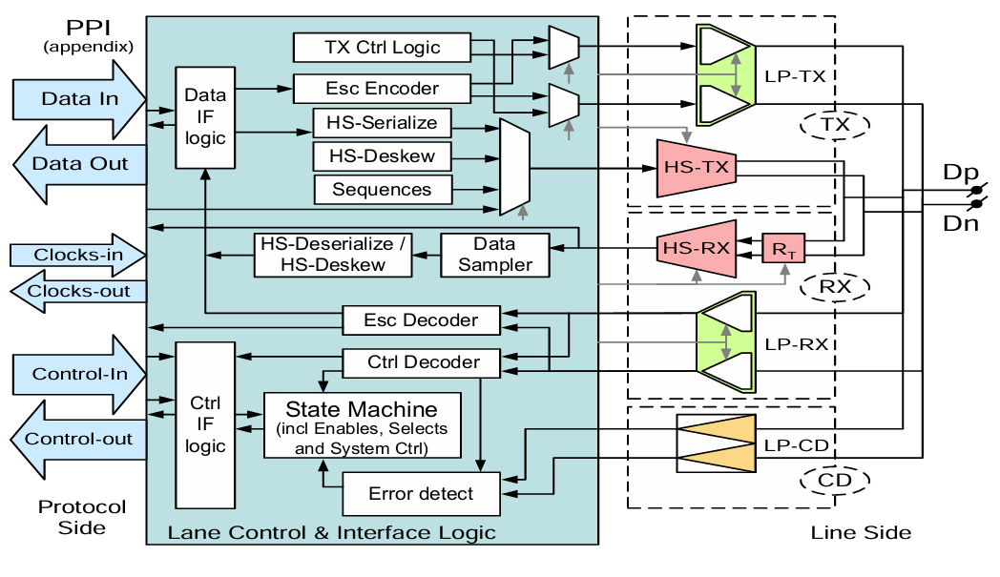

# Design and Implementation of MIPI D-PHY Transmitter and Receiver

## Overview

This project presents a design and implementation of a MIPI (Mobile Industry Processor Interface) D-PHY transmitter and receiver system. The D-PHY specification defines the physical layer for high-speed serial interfaces commonly used in mobile and embedded systems for camera sensor interfaces, display connections, and other high-bandwidth applications.

## Table of Contents

- [Overview](#overview)
- [MIPI D-PHY Background](#mipi-d-phy-background)
- [System Architecture](#system-architecture)
- [Implementation Details](#implementation-details)
- [Practical Applications](#practical-applications)
- [RTL Structure](#rtl-structure)
- [Module Descriptions](#module-descriptions)
- [Getting Started](#getting-started)
- [Simulation and Testing](#simulation-and-testing)
- [Contributing](#contributing)
- [License](#license)

## MIPI D-PHY Background

The MIPI D-PHY (Display Physical Layer) is a specification developed by the MIPI Alliance that defines a high-speed serial interface physical layer. It operates in two primary modes:

- **High-Speed (HS) Mode**: Differential signaling for high data rates
- **Low-Power (LP) Mode**: Single-ended signaling for control and low-speed data transmission

The D-PHY typically consists of clock and data lanes operating as differential pairs, with bidirectional communication capability and power-efficient design optimized for battery-powered devices.

## System Architecture

### System Block Diagram


### Master-Slave Configuration
*[Master-slave diagram placeholder - Insert diagram showing the master-slave relationship and data flow between transmitter and receiver]*

## Implementation Details

Based on the RTL implementation, this project includes the following key components:

### Transmitter Components
- **MIPI TX**: Main transmitter module handling data transmission
- **MIPI TX Controller**: Control logic for transmission operations
- **TX Clock Management**: Clock generation and distribution for transmitter
- **Serial Data Transmission**: Conversion of parallel data to serial format

### Receiver Components  
- **MIPI RX**: Main receiver module for data reception
- **MIPI RX Controller**: Control logic for reception operations
- **RX Clock Management**: Clock recovery and distribution for receiver
- **Serial Data Reception**: Conversion of serial data back to parallel format

### Core Features
- Single lane D-PHY implementation
- High-Speed (HS) mode operation
- Separate transmitter and receiver designs
- Dedicated controller modules for TX/RX operations
- Clock management for both transmission and reception paths

## Practical Applications

The MIPI D-PHY interface finds extensive use in modern electronic systems:

### Mobile Devices
- **Camera Sensor Interface**: Connecting image sensors to application processors in smartphones and tablets
- **Display Interface**: High-resolution display connectivity for mobile screens
- **Multi-Camera Systems**: Supporting camera configurations in mobile devices

### Automotive Systems
- **ADAS Cameras**: Advanced Driver Assistance Systems requiring high-bandwidth camera data
- **Surround View Systems**: Camera inputs for vehicle monitoring systems
- **In-Vehicle Infotainment**: Display connectivity for dashboard systems

### Industrial and IoT Applications
- **Machine Vision**: Camera interfaces for industrial inspection systems
- **Medical Imaging**: Endoscopic cameras and medical imaging equipment
- **Security Systems**: Camera connectivity for surveillance systems
- **Embedded Vision**: Computer vision applications in embedded systems

### Computing and Edge Applications
- **Edge Devices**: Camera input for processing at the edge
- **Single Board Computers**: Camera modules for development boards
- **IoT Devices**: Camera interfaces for smart devices

## RTL Structure

The RTL implementation is organized as follows:

```
RTL/
├── MIPI_RX.v                    # Main MIPI receiver module
├── MIPI_RX_Controller.v         # RX control logic
├── MIPI_TX.v                    # Main MIPI transmitter module  
├── MIPI_TX_Controller.v         # TX control logic
├── RX_Clock_Manager.v           # Receiver clock management
├── TX_Clock_Manager.v           # Transmitter clock management
└── testbench/                   # Verification testbenches
```

## Getting Started

### Prerequisites
- Verilog HDL simulator (ModelSim, QuestaSim, or equivalent)
- Synthesis tool (Synopsys Design Compiler, Xilinx Vivado, etc.)
- Basic understanding of MIPI D-PHY concepts

### Quick Start
1. Clone the repository
```bash
git clone https://github.com/MohamedEhab13/Design-and-Implementation-of-MIPI-D-PHY-Transmitter-and-Receiver.git
```

2. Navigate to the RTL directory
```bash
cd Design-and-Implementation-of-MIPI-D-PHY-Transmitter-and-Receiver/RTL
```

3. Set up your simulation environment and compile the design files

4. Run the provided testbenches to verify functionality

## Simulation and Testing

The project includes testbenches for:
- Individual module verification
- Transmitter functionality testing
- Receiver functionality testing  
- Clock manager validation
- Controller logic verification

## Contributing

We welcome contributions to improve the design and implementation. Please:

1. Fork the repository
2. Create a feature branch
3. Implement your changes with appropriate testbenches
4. Submit a pull request with detailed description

## License

This project is licensed under the MIT License - see the [LICENSE](LICENSE) file for details.

---

**Note**: This implementation is for educational and research purposes. For commercial applications, ensure compliance with MIPI Alliance licensing requirements and obtain necessary IP licenses.
